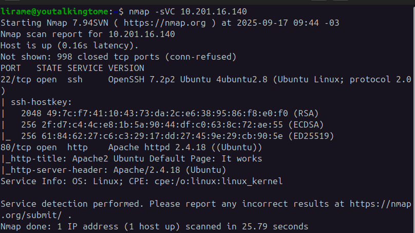

# LazyAdmin

<aside>
💡 Resolvido e escrito em 17 de Setembro de 2025
</aside>


Primeiramente, escaneamos as portas usando nmap.

```jsx
nmap -sVC 10.201.16.140
```



Encontramos as portas `ssh` e `http` abertas. Entramos na porta 80 pelo browser primeiro e rodamos uma enumeração de diretórios nela usando gobuster. A wordlist utilizada foi a common, do SecLists, disponível aqui.

[https://github.com/danielmiessler/SecLists/blob/master/Discovery/Web-Content/common.txt](https://github.com/danielmiessler/SecLists/blob/master/Discovery/Web-Content/common.txt)

```jsx
gobuster dir -u http://10.201.16.140/ -w common.txt
```


Encontramos um interessante diretório `/content/`, então vamos fazer uma enumeração dentro dele.

```jsx
gobuster dir -u http://10.201.16.140/content -w common.txt
```


Explorando cada um desses diretório no browser, encontramos que o /`content/as/` possui uma página de login, na qual talvez possamos explorar alguma vulnerabilidade. 


O serviço utilizado por essa máquina para esse login é o `SweetRice`, que é um “sistema de gerenciamento de site”, com mecanismos de gerenciar arquivos e etc. Pesquisando um pouco sobre esse sistema, descobrimos que ele salva senhas em /content/inc/mysql_backup.


Baixamos esse arquivo e procuramos por password ou similares e encontramos o seguinte.


Encontramos as credenciais manager:42f749ade7f9e195bf475f37a44cafcb, mas ao testar 42f749ade7f9e195bf475f37a44cafcb, descobrimos que esta não é uma senha de fato. Pela aparência dela, podemos deduzir que é um hash da senha verdadeira, o que é muito utilizado por aplicações do mundo real ao invés de guardar a senha diretamente em um banco de dados.

Então fomos no site [https://md5hashing.net/](https://md5hashing.net/) e utilizamos a seção “Reverse hash decoder” na opção “Search all types” para tentar quebrar esse hash com base em algum dos principais algoritmos de hash modernos. O sistema conseguiu identificar esse hash como Md5 e encontrou se valor original.


Agora sim temos as credenciais `manager:Password123`. Logando no sistema, encontramos uma interessante seção “Media Center”, onde é possível gerir os arquivos hospedados por esse serviço no computador. É possível criar pastas e fazer upload de arquivos por aqui, o que possivelmente abre espaço para um reverse shell, então vamos tentar.

Usamos o conhecido reverse shell desse site:

[https://github.com/pentestmonkey/php-reverse-shell](https://github.com/pentestmonkey/php-reverse-shell)

Alteramos o ip do arquivo para o ip da nossa própria máquina (o atacante) e a porta para 9000. Salvamos o arquivo como shell.php e tentamos fazer upload; não foi possível, pois o sistema barra o upload de arquivos com extensão .php. Uma forma comum de burlar isso é salvar o arquivo como shell.php5 e tentar fazer upload novamente, o que funcionou.


Antes de executar o arquivo, inicializei um escutador para receber o shell da máquina.

```jsx
nc -lnvp 9000
```


Clicando aqui, recebemos o shell da máquina. Fizemos um upgrade do shell antes de prosseguir para minizar a chance do shell travar ou apresentar inconsistências.

### Passo a passo para dar upgrade no shell:

1. `python3 -c 'import pty; pty.spawn("/bin/bash")'`
2. CTRL + Z
3. `stty raw -echo`
4. `fg`
5. `reset`
6. (se o terminal perguntar qual o tipo de terminal) `xterm` OR `xterm-256color`

Pronto, nosso shell está melhorado, agora vamos prosseguir. Assim, podemos imprimir a flag do usuário, que está em `/home/itguy/user.txt`.

Primeiro, listamos os comandos que nosso usuário pode rodar com privilégios de root.

```jsx
sudo -l
```


Podemos executar o arquivo `/home/itguy/backup.pl` usando Perl com privilégios de root. Vamos ver o que tem nesse arquivo até o momento.


O arquivo está chamando o bash e executando os comandos bash dentro de `/etc/[copy.sh](http://copy.sh)`. Podemos sobrescrever o conteúdo desse arquivo copy.sh com `bash` para que seja aberto um terminal bash com privilégios de root ao executar o comando do Perl com privilégios de root.

Então vamos sobrescrever o arquivo…


…  e rodar o código perl.


Pronto, somos root e imprimimos a flag do root em `/root/root.txt`